# Fluor Framework

## Introduction

To understand what this framework is about, we need to introduce various concepts
around caching and the challenges we're facing when trying to implement it correctly.

Let's imagine we have the following definition:

```scala
object NaiveModel:
    var n = 0
    def x = n + 2
    def y = x + 3
    def z = x * 2
    def t = y + z
```

A call to `t` would cause its _dependencies_ (in this case `y` and `z`) to be called
in turn, causing a ripple effect that will end with the _leaf_ `n` is reached (which will
happen twice in this instance).

It is clear that no matter how many times we recalculate them, these methods will return the same value if `n` hasn't changed since. To summarize, we're doing more calculations than necessary.

Let's try to optimize that by introducing some caching, let's say for `t`:

```scala
object NaiveModel2:
  var n = 0
  def x = n + 2
  def y = x + 3
  def z = x * 2

  private var _t: Option[Integer] = None
  def t =
    _t match {
      case None =>
        val value = y + z
        _t = Some(value)
        value
      case Some(v) => v
    }
```

The code is now a bit chunkier, but it works. On first evaluation, the chain of calls
will be the same but this time the result will be stored in `_t` (its value changing
from `None` to `Some(9)`). If we call `t` again, the result will be already available.

What happens if we increment `n` after that first call? In the previous uncached version,
the value returned by `t` after that update would be `12`. But in this case, the cached
version would return the same value `9` which is not what we want. The cache contains
a value which used to be correct, but is no longer after `n` was updated and therefore
is said to be _stale_. Essentially, we're skipping calculations we should be doing.

We can fix this by adding some code to _invalidate_ the cache whenever `n` is updated:

```scala
object NaiveModel3:
  private var _n = 0
  def n = _n
  def n_= (value: Integer): Unit =
    if value != _n then
      _t = None
      _n = value
    
  def x = n + 2
  def y = x + 3
  def z = x * 2

  private var _t: Option[Integer] = None
  def t =
    _t match {
      case None =>
        val value = y + z
        _t = Some(value)
        value
      case Some(v) => v
    }
```

In this version, calling `t` will trigger only one chain of evaluation at
first time and then just cache _recalls_ after that. As soon as `n` is set to
another value, the cache will be invalidated and any call to `t` will trigger
another full evaluation whose outcome will be cached again upon completion.
This time, we just do the right amount of calculation. No more than necessary,
but no less either.

Let's expand our example and include another class:

```scala
class NaiveView(modulo: Integer):
  private var _u: Option[Integer] = None
  def u =
    _u match {
      case None =>
        val value = NaiveModel3.t % modulo
        _u = Some(value)
        value
      case Some(v) => v
    }
```

The situation gets more complex because we know that at some point we may
have one or more instances of `MyView` whose member `u` could have been
evaluated already, and therefore cached. For example like this:

```scala
val myView1 = NaiveView(7)
assert(myView1.u == 2)  // myView1.u is now cached

val myView2 = NaiveView(12)
assert(myView2.u == 9)  // myView2.u is now cached

NaiveModel3.n = 1
```

After that last assignment, `myView1.u` and `myView2.u` should be invalidated.
But how would the setter of `NaiveModel3.n` would know about the existence of these
caches and how would it refer to them? It could invalidate `NaiveModel3.t` because
the cache was part of the same definition, but for `MyView` it is different because
its definition might have been created way later.

This example illustrate the fact that naive invalidation like we've seen above
doesn't scale. A correct invalidation strategy would require to keep track of
_dynamic_ dependencies between caches and invalidate them accordingly.

This is what Fluor is about.

## Getting Started

We're going to implement in Fluor the cached equivalent of the examples we've
seen in the previous chapter. Let's start with `NaiveModel`:

```scala
import eb2501.fluor.core.Page

object FluorModel extends Page:
  val n = write { 0 }
  def x = n.^ + 2
  def y = x + 3
  def z = x * 2
  val t = read { y + z }
```

New constructions have been used here that require more explanations.

The members `n` and `t` are now _nodes_ instead of just being `var` and `def`
constructs. These nodes are created using the protected methods of the `Page` class
`write()` and `read()` (there are others as well as we'll see later).

We request the value of a node by calling its `^` property, which can trigger the
evaluation of the associated closure when the value hasn't been cached yet.

Let's now put it to the test:

```scala
assert(FluorModel.n.^ == 0)
assert(FluorModel.x == 2)
assert(FluorModel.y == 5)
assert(FluorModel.z == 4)
assert(FluorModel.t.^ == 9)
```

So far, so good. Now we're updating `n` and see what happens:

```scala
FluorModel.n.^ = 1

assert(FluorModel.n.^ == 1)
assert(FluorModel.x == 3)
assert(FluorModel.y == 6)
assert(FluorModel.z == 6)
assert(FluorModel.t.^ == 12)
```

Results are correct. But are caches really effective? We can find out by counting
how many times `t` is evaluated under different scenari:

```scala
object FluorModel2 extends Page:
  val n = write { 0 }
  def x = n.^ + 2
  def y = x + 3
  def z = x * 2

  var countT = 0
  val t = read {
    countT += 1
    y + z
  }

assert(FluorModel2.countT == 0)

assert(FluorModel2.t.^ == 9)
assert(FluorModel2.countT == 1)

val temp1 = FluorModel2.t.^ + 1
assert(FluorModel2.countT == 1)

FluorModel2.n.^ = 1

assert(FluorModel2.t.^ == 12)
assert(FluorModel2.countT == 2)

val temp2 = FluorModel2.t.^ + 1
assert(FluorModel2.countT == 2)
```

We see that `t` has been evaluated twice, and this is exactly what we want.

Let's go ahead with the rewrite of `NaiveView`:

```scala
class FluorView(modulo: Integer) extends Page:
  val u = read (FluorModel.t.^ % modulo)
```

Does it work this time? Let's find out:

```scala
val myView1 = FluorView(7)
assert(myView1.u.^ == 5)

val myView2 = FluorView(12)
assert(myView2.u.^ == 0)

FluorModel.n.^ = 2
assert(myView1.u.^ == 1)
assert(myView2.u.^ == 3)
```

Good!

## The dependency DAG

We've mentioned earlier that `read()` and `write()` methods from the `Page` class
are used for building nodes, but what is a node exactly? The answer to this question
lies in the definition of the `Node` trait:

```scala
package eb2501.fluor.core

trait Node:
  def isCached: Boolean
  def callees: Option[Set[Node]]
  def callers: Option[Set[Node]]
```

On each instance, you can query their cache status, get the nodes they called
during their evaluation (the `callees` method) and the cached nodes that have
queried their value during their own evaluation (the `callers` method). Both
methods return `None` if the node is not cached.

To illustrate these facts going forward, we're going to introduce a graphical
representation called the _dependency DAG_ that will abstract away all
implementation details.

Let's assume that we're starting with a fresh session where we just defined
`FluorModel` and `FluorView`. The DAG at this point can be represented like
this:

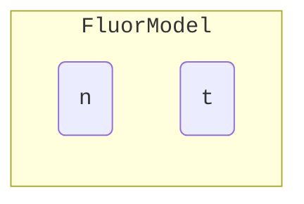

Each `Page` instance will be represented by a square, within which will be put all
the nodes it contains. The shape of these nodes represent their cache status and for
now we see two rounded-box as `n` and `t` are uncached.

We can programmtically verify that the graph is indeed correct:

```scala
assert(!FluorModel.n.isCached)
assert(FluorModel.n.callees == None)
assert(FluorModel.n.callers == None)
assert(!FluorModel.t.isCached)
assert(FluorModel.t.callees == None)
assert(FluorModel.t.callers == None)
```

We can notice that regular members like `y` are not represented in
this graph because they're not proper nodes. As such, they're completely
transparent as far as Fluor is concerned and the following code would be
deemed equivalent from Fluor standpoint:

```scala
object FluorModelB extends Page:
  val n = write { 0 }
  val t = read {
    val x = n.^ + 2
    val y = x + 3
    val z = x * 2
    y + z
  }
```

Let's now evaluate `FluorModel.t`:

```scala
assert(FluorModel.t.^ == 9)
```

The graph now looks like this:

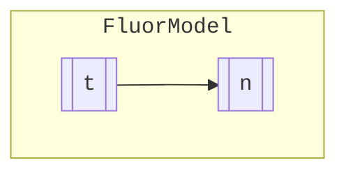

The rounded boxes have now become double-square ones, meaning they
are now cached. The arrow identifies a caller-callee relationship (the
latter being pointed at).

Here's how we can verify that state in the code:

```scala
assert(FluorModel.n.isCached)
assert(FluorModel.n.callees == Some(Set()))
assert(FluorModel.n.callers == Some(Set(FluorModel.t)))

assert(FluorModel.t.isCached)
assert(FluorModel.t.callees == Some(Set(FluorModel.n)))
assert(FluorModel.t.callers == Some(Set()))
```

Let's also represent the `MyView` instances being created:

```scala
val myView1 = FluorView(7)
assert(myView1.u.^ == 2)

val myView2 = FluorView(12)
assert(myView2.u.^ == 9)
```

Here's the graph now:

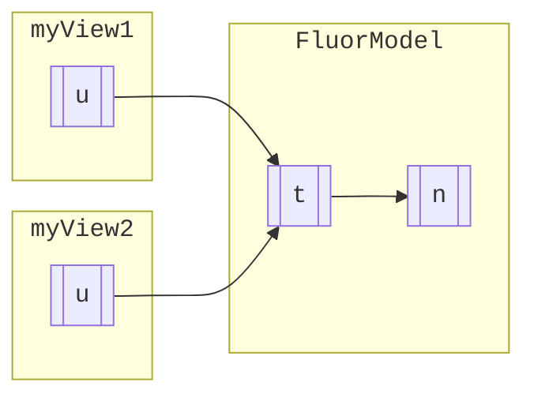

We can programmatically trace back the callers of `FluorModel.t` to
the instances of `FluorView` that are referring to it:

```scala
assert(FluorModel.t.callers == Some(Set(myView1.u, myView2.u)))
```

## The Invalidation Process

Let's illustrate how invalidation works by starting with a more complex
example:

```scala
object MyModel extends Page:
  val x = clear { 0 }
  val y = write { 11 }
  val flag = write true
  val t =
    val x2 = x.^ * 2
    if flag.^ then
      x2 + y.^
    else
      x2 + 1
  val u = read { y.^ + 32 }
  val v = read { x.^ + u.^ }
```

The `x` node if defined using the `clear` method which is similar to `write`, but
also _clearable_ (we'll see about this below).

We'll focus on how the DAG evolves throughout different scenarii. To start with, we
can expect the graph to be full of uncached nodes:

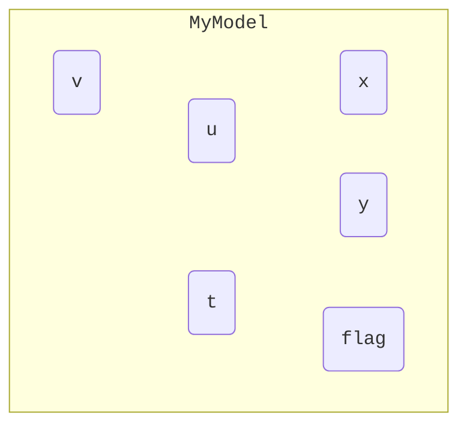

Let's start by evaluating `x` and `flag`:

```scala
assert(MyModel.x.^ == 0)
assert(MyModel.flag.^ == true)
```

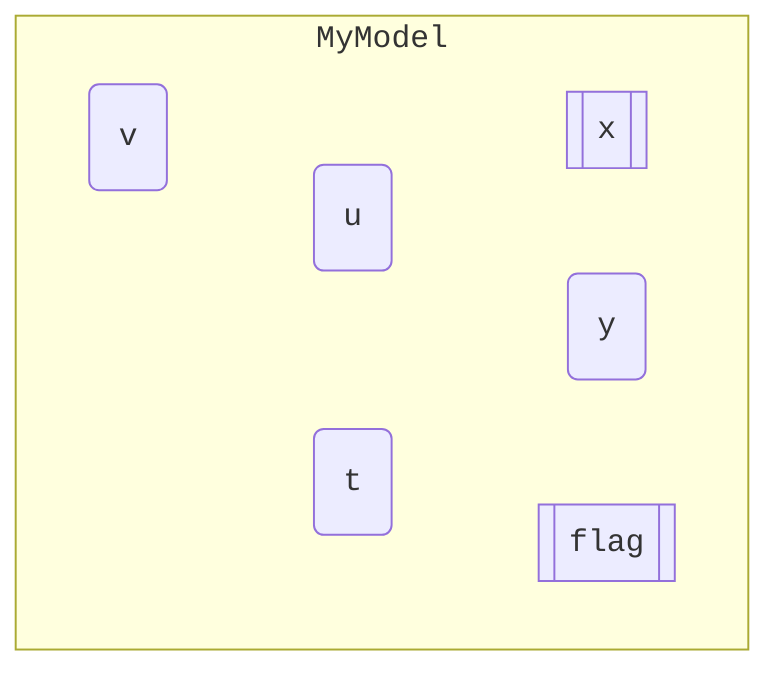

Since the expressions tied to these two nodes don't refer to any other node, we
end up with no outgoing arrows. Note that we only cached `x` and `flag`, the
other nodes are still uncached.

We then evaluate `v` now:

```scala
assert(MyModel.v.^ == 43)
```

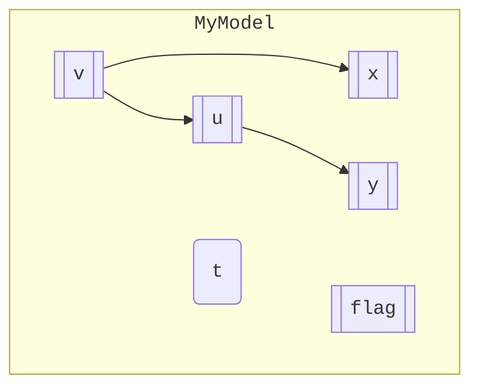

The evaluation of `u` and `y` were a side-effect of the evaluation of `v`.

Let's finish by evaluating the remaining node `t`:

```scala
assert(MyModel.t.^ == 43)
```

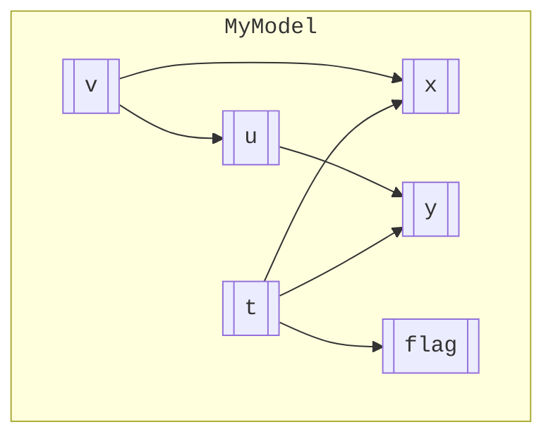

When a node is invalidated, the following happens:

  - all its callers are invalidated recursively
  - all outgoing arrows are removed from the node
  - the cache is cleared

As an example, here's the outcome of clearing `x` of its cache:

```scala
MyModel.x.clear()
```

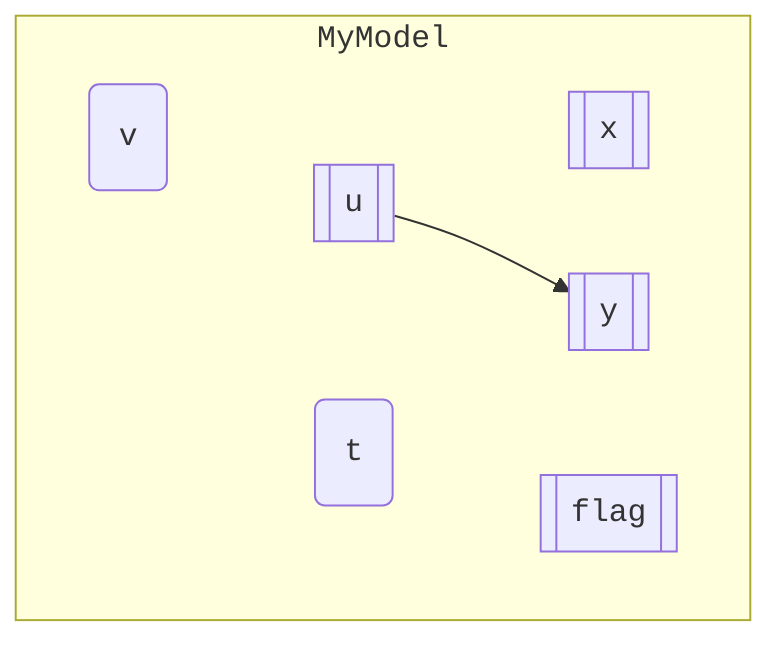

Coming back to the fully evaluated DAG, let's figure out what would happen
after the following code:

```scala
MyModel.flag.^ = false
```

Setting a node is similar to an invalidation, except that the node would still be cached but
devoid of any dependency.


Let's re-evaluate `t` now:

```scala
assert(MyModel.t.^ == 1)
```

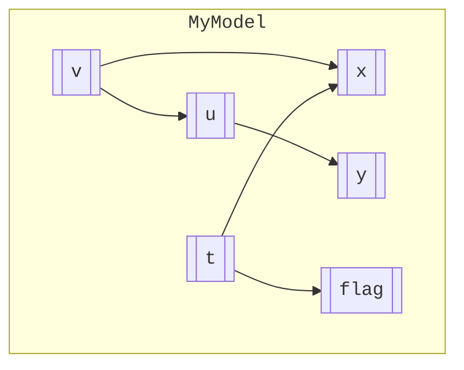

The shape of the DAG is different this time because `t` no longers relies
on `y` to calculate its value. This illustrates the dynamic nature of the
DAG.

## Proxies

Let's introduce a temperature converter:

```scala
class Converter extends Page:
  val celsius = write { 0.0 }
  val fahrenheit = read { celsius.^ * 1.8 + 32.0 }

  def adjust(value: Double): Unit =
    celsius.^ += value
```

Its behavior is quite straightforward:

```scala
val converter = Converter()
assert(converter.celsius.^ == 0.0)
assert(converter.fahrenheit.^ == 32.0)
converter.celsius.^ = 100.0
assert(converter.fahrenheit.^ == 212.0)
converter.adjust(-20.0)
assert(converter.fahrenheit.^ == 176.0)
```

For reference, here's the DAG after the last operation:

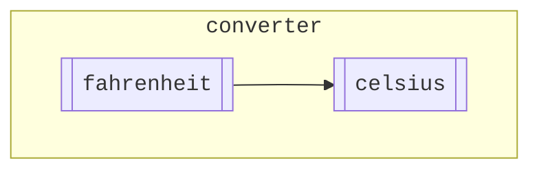

Suppose we now have a separate object which provides the temperature for
a given station:

```scala
object Provider extends Page:
  val temperature = write { 20.0 }
```

What we would like in that situation is to be able to create a `Converter` 
instance where the `celsius` member would be bound to the `temperature` 
member of `Provider`.

The initial reflex would be to create a new definition of `Converter` to
that effect:

```scala
class Converter2 extends Page:
  val fahrenheit = read { Provider.temperature.^ * 1.8 + 32.0 }

  def adjust(value: Double): Unit =
    Provider.temperature.^ += Provider.temperature.^
```

This solution works, But unfortunately `Converter2` is not a subclass
of the original `Converter`, which leads to business logic duplication.

Let's rather derive from `Converter` and override the `celsius` member:

```scala
class Converter2 extends Converter:
  override val celsius = write { Provider.temperature.^ }
```

This solution seem to work:

```scala
val converter2 = Converter2()

assert(converter2.fahrenheit.^ == 78.0)
Provider.temperature.^ = 100.0
assert(converter2.fahrenheit.^ == 212.0)
```

At this stage, we have the following DAG:

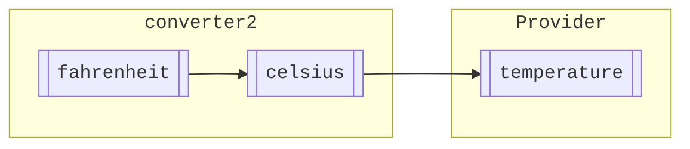

But here comes the catch:

```scala
converter2.adjust(-20.0)
assert(converter2.fahrenheit.^ == 176.0)
```

The DAG is now like this:

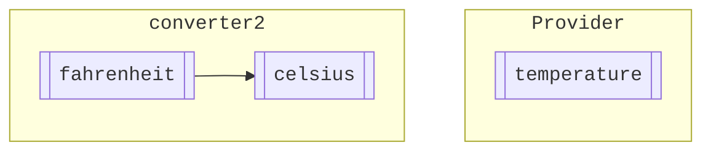

The `celsius` node is now disconnected from `temperature` and leads to
this:

```scala
Provider.temperature.^ = 0.0
assert(converter2.fahrenheit.^ != 32.0)
```

The solution will come from the use of a _proxy_ which behaves like a
node whose implementation is entirely controlled by callbacks. But
first, we need to change the signature `celsuis` in the original
`Converter` class:

```scala
class ConverterB extends Page:
  val celsius: Write[Double] = write { 0.0 }
  val fahrenheit = read { celsius.^ * 1.8 + 32.0 }

  def adjust(value: Double): Unit =
    celsius.^ += value
```

The return type of the `write()` method is `Write[T] & Node`. The former
type represent the bare get/set capabilities whereas the latter reflects
the fact that it has its own cache and dependencies, and therefore is part
of the DAG.

A proxy only derives from `Write[T]` since it doesn't have any cache on its
own, hence the need for the change above. We can now write:

```scala
class ConverterB2 extends ConverterB:
  override val celsius = proxy {
    Provider.temperature.^
  } { value =>
    Provider.temperature.^ = value
  }
```

The first callback is the _getter_ which is called every time the proxy's
value is accessed. The second one is the _setter_ which is called whenever the proxy has its value assigned (the argument is the value assigned).

This now works as expected:

```scala
val converterB2 = ConverterB2()

assert(converter.fahrenheit.^ == 78.0)
Provider.temperature.^ = 100.0
assert(converter.fahrenheit.^ == 212.0)
Provider.temperature.^ = 0.0
assert(converter.fahrenheit.^ == 32.0)
```

The DAG would look like this:

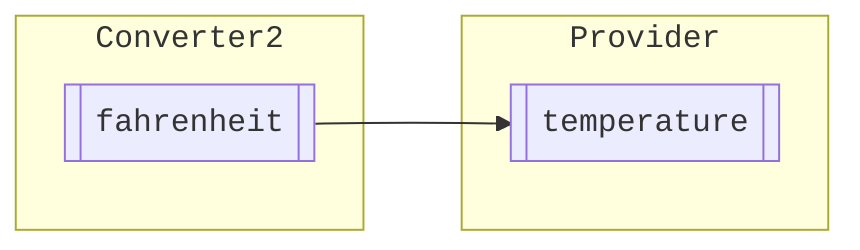

Since we're completely free to choose whatever callback we want, we can
change that example so that the adjustment doesn't have any effect at all:

```scala
class ConverterB3 extends ConverterB:
  val celsius = proxy {
    Provider.temperature.^
  } { value => () }
```

## Parameterized Nodes

Nodes can be parameterized by a key:

```scala
object Model extends Page:
  val x = write { 1 }
  val y = write { 2 }
  val z = read { (key: Boolean) =>
    if key
    then x.^ + y.^
    else x.^ * 2
  }
```

You use them like this:

```scala
assert(Model.z(true).^ == 3)
```

The DAG will now look like this:

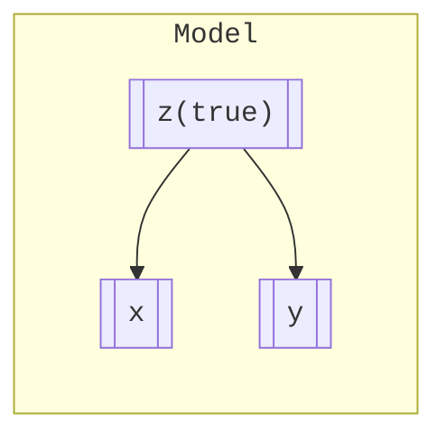

Let's evaluate `z(false)` as well:

```scala
assert(Model.z(false).^ == 2)
```

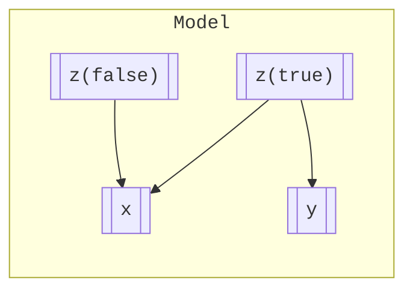

We can see that each call on `z` creates a distinct node, with their own
cache and dependencies.

Let's invalidate `y` now:

```scala
Model.y^ = 5
```

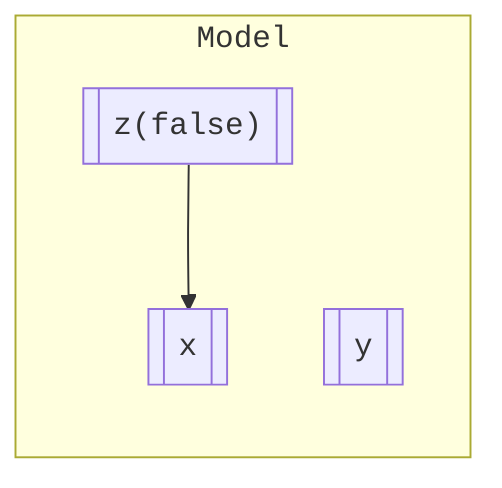

The `z(true)` node has now disappeared because parameterized nodes will
only keep their cache nodes.

Note the difference if we didn't use a parameterized node:

```scala
object Model2 extends Page:
  val x = write { 1 }
  val y = write { 2 }
  val z_true = read { x.^ + y.^ }
  val z_false = read { x.^ * 2 }
```

The bahevior would be the same:

```scala
assert(Model2.z_true.^ == 3)
assert(Model2.z_false.^ == 2)
```

And so would be the DAG:

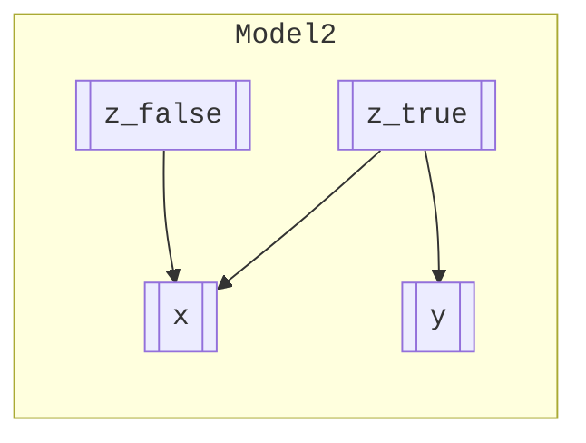

But the same invalidation would lead to a different DAG:

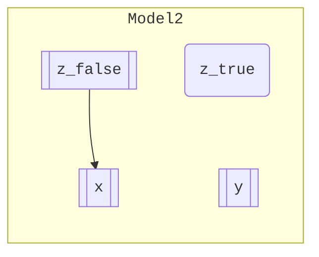

Since `z_true` is a proper node of its own, it still exists in an uncached
state.

We can also have writable parameterized nodes:

```scala
object ModelB extends Page:
  val x = write { 1 }
  val y = write { 2 }
  val z = write { (key: Boolean) =>
    if key
    then x.^ + y.^
    else x.^ * 2
  }
```

And they will behave as expected:

```scala
assert(ModelB.z(true).^ == 3)
assert(ModelB.z(false).^ == 2)
ModelB.z(true).^ = 5
```

This leaves us with the following DAG:

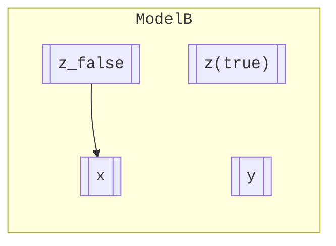

In this case the `z(true)` stays around since it holds now holding the
value it's been assigned.

If we want the ability to manually remove instances of parameterized nodes,
we need to use the `clear` method:

```scala
object ModelC extends Page:
  val x = write { 1 }
  val y = write { 2 }
  val z = clear { (key: Boolean) =>
    if key
    then x.^ + y.^
    else x.^ * 2
  }
```

This example behaves exactly like `ModelB`, except that we can now clear
the cache of `z(true)` directly:

```scala
ModelC.z(true).clear()
```

Which would leave a DAG like this:

```mermaid
%%{init: { "fontFamily": "monospace" } }%%
graph LR
subgraph ModelC
  ModelB_x[[x]]
  ModelB_y[[y]]
  Model2_z_false[["z_false"]]
  Model2_z_false --> ModelB_x
end
```

You can iterate over the list of keys that are currently cached:

```scala
assert(ModelC.z.toSet == Set(false))
```

There's also a two-parameter version:

```scala
object ModelD extends Page:
  val x = write { 1 }
  val y = write { 2 }
  val z = read { (selector: Boolean, delta: Integer) =>
    (
      if selector
      then x.^ + y.^
      else x.^ * 2
    ) + delta
  }
```

In this case, every combination of `selector` and `delta` will create its own node instance:

```scala
assert(ModelD.z(true, 0).^ == 3)
assert(ModelD.z(true, 1).^ == 4)
assert(ModelD.z(false, 0).^ == 2)
```

Here's the corresponding DAG after these assertions:

```mermaid
%%{init: { "fontFamily": "monospace" } }%%
graph LR
subgraph ModelD
  ModelD_x[[x]]
  ModelD_y[[y]]
  ModelD_z_true_0[["z(true, 0)"]]
  ModelD_z_true_1[["z(true, 1)"]]
  ModelD_z_false_0[["z(false, 0)"]]
  ModelD_z_true_0 --> ModelD_x
  ModelD_z_true_0 --> ModelD_y
  ModelD_z_true_1 --> ModelD_x
  ModelD_z_true_1 --> ModelD_y
  ModelD_z_false_0 --> ModelD_x
end
```

Unsurpisingly, you can iterate through the key pairs:

```scala
assert(ModelD.z.toSet == Set((true, 0), (true, 1), (false, 0)))
```

## Monitoring Nodes

We can attach a callback (called _listener_) to a node we want to monitor (see the definition
of `y` below):

```scala
object Model extends Page:
  val x = write { 1 }

  val events = ArrayDeque.empty[Event[Int]]
  val y = write_ln { x.^ + 1 } { events += _ }

  val z = write { y.^ + 1 }
```

The callback takes an `Event[T]` instance as argument, which is defined like this:

```scala
enum Event[+T] {
  case Cached(value: T, callees: immutable.Set[Node])
  case Invalidated
  case Set(value: T)
  case Cleared
  case CallerAdded(caller: Node)
  case CallerRemoved(caller: Node)}
```

Note that the binding to the listener happens during node creation, and can't be changed
thereafter. The following code illustrates the different events that could be received
by the listener:

```scala
// y is becoming cached
assert(Model.y.^ == 2)
assert(Model.events == List(
  Event.Cached(2, Set(Model.x))
))
Model.events.clear()

// y has a new caller
assert(Model.z.^ == 3)
assert(Model.events == List(
  Event.CallerAdded(Model.z)
))
Model.events.clear()

// y has a caller removed
Model.z.^ = 4
assert(Model.events == List(
  Event.CallerRemoved(Model.z)
))
Model.events.clear()

// y is invalidated
Model.x.^ = 2
assert(Model.events == List(
  Event.Invalidated
))
Model.events.clear()

// y is assigned a value
Model.y.^ = 5
assert(Model.events == List(
  Event.Set(5)
))
```

You can also monitor parameterized node, in which case the listener will take the keys as additional
arguments:

```scala
object ModelB extends Page:
  val x = write { 1 }
  val y = write { 2 }

  val events = ArrayDeque.empty[(Boolean, Event[Int])]
  val z = write_ln { (key: Boolean) =>
    if key
    then x.^ + y.^
    else x.^ * 2
  } { (key, event) =>
    events += ((key, event))
  }
```

## Considerations

Here's a compilation of various considerations regarding the practical use of Fluor.

### Threads Compatibility

It is important to know that Fluor uses a global structure in order to build the DAG and as such, it
is then not safe to have multiple threads interacting concurrently with parts of the DAG that are
connected.

Thanks to the use of thread-local storage, it is however possible to have multiple threads interacting
with disjoints parts of the DAG. The rule is that a thread can only interact with nodes that were
constructed by that same thread.

Let's see an example of incorrect use:

```scala
object Model extends Page:
  val x = write { 1 }

assert(Model.x.^ == 1)
val f = Future {
  Model.x.^ = 2
}

assertRaises[IllegalArgumentException] {
  Await.result(f, Duration.Inf)
}
```

The multi-threaded feature enables the Fluor framework to be compatible with actor-based systems such as Akka.

### Implicit conversion

Fluor uses implicit conversions to make the syntax more concise:

```scala
object Model extends Page:
  val x = write { 1 }
  val y = read { x + 1 }

assert(Model.y.^ == 2)
```

In the definition of `y`, the reference to `x` is automatically converted from an instance of `Read[Int]` to an `Int`.

While useful in some situations, beware that it doesn't work in all cases:

```scala
assert(Model.y == 2)
```

This assertion doesn't compile as the multiversal equality would prevent comparing the `y` node to an `Int`.

### Transparency

Let's review the following example:

```scala
class Item(start: Int) extends Page:
  def x = write { start }

given Ordering[Item] with
  override def compare(a: Item, b: Item): Int =
    a.x.^ compare b.x.^

val items = List(Item(5), Item(2), Item(3), Item(1), Item(4))

def sortFromLibrary(items: List[Item]): List[Item] =
  items.sorted

object Model extends Page:
  val sequence = read { sortFromLibrary(items) }
```

Let's pretend that the `sortFromLibrary` is a function that's defined in another library which has nothing
to do with Fluor (which is true here since `sorted` comes from the Scala standard library).

First, the value of `sequence` comes as expected:

```scala
assert(Model.sequence.^ == List(items(3), items(1), items(2), items(4), items(0)))
```

The DAG looks like this:

```mermaid
%%{init: { "fontFamily": "monospace" } }%%
graph LR
subgraph "Item(5)"
  Item_5_x[[x]]
end
subgraph "Item(4)"
  Item_4_x[[x]]
end
subgraph "Item(3)"
  Item_3_x[[x]]
end
subgraph "Item(2)"
  Item_2_x[[x]]
end
subgraph "Item(1)"
  Item_1_x[[x]]
end
subgraph Model
  Model_sequence[[sequence]]
  Model_sequence --> Item_1_x
  Model_sequence --> Item_2_x
  Model_sequence --> Item_3_x
  Model_sequence --> Item_4_x
  Model_sequence --> Item_5_x
end
```

This illustrates that the use of an agnostic middle layer (the `sortFromLibrary` function) doesn't prevent the
inference of a correct DAG. Moreover, any (relevant) change in an `Item` instance will rightfully cause the
`sequence` node to be invalidated:

```scala
items(1).x.^ = 10
assert(Model.sequence.^ == List(items(3), items(2), items(4), items(0), items(1)))
```

Essentially, the use of Fluor is compatible with any existing library.

### Interfaces

It is good practice to declare the node's signature as in this example:

```scala
trait Model extends Page:
  val x: Write[Int] = write { 1 }
  val y: Read[Int] = read { x.^ + 1 }
```

Omitting the `Node` part is usually what we want because it allows future implementers to derive from
that class and override specific nodes with proxies:

```scala
class ModelB extends Model:
  override val x = proxy { 2 } { _ => () }
```

### Determinism

Fluor keeps track of the sequential order by which callers and callees are recorded, which gives the user
complete determinism across identical runs:
 - nodes are invalidated in the same order
 - listeners are executed in the same order
 - debugging is easier

Note that `callers` and `callees` properties of the `Node` trait reflects that order.

### Side Effects

It is considered best to avoid any setting/clearing of a node during the evaluation of
another. Any attempt to do so will be rejected with an exception:

```scala
object Model extends Page:
  val x = write { 1 }
  val y = write { True }
  val z = read {
    y.^ = False
    x.^ + 1
  }

assertThrows[IllegalArgumentException] {
  Model.z.^
}
```

Regarding listeners we advise against including any operation that changes the DAG (including
checking a node's value), though it isn't strictly enforced.

### Capturing Dependencies

Let's look at the following example:

```scala
class Data(value: Int) extends Page:
  val x = write { value }

val data1 = Data(1)
val data2 = Data(2)

var source = data1

object Reader extends Page:
  val value = read { source.x.^ + 5 }
```

So far, we have the expected result:

```scala
assert(Reader.value.^ == 6)
```

The DAG looks like this:

```mermaid
%%{init: { "fontFamily": "monospace" } }%%
graph LR
subgraph data2
  data2_x(x)
end
subgraph data1
  data1_x[[x]]
end
subgraph Reader
  Reader_value[[value]]
  Reader_value --> data1_x
  Reader_value --- data2_x

  linkStyle 1 stroke:none
end
```

Let's now change the value of `source`:

```scala
source = data2
```

But nothing happens (and the DAG remains the same):
```scala
assert(Reader.value.^ == 6)
```

The reason is that `source` is not monitored by Fluor, and therefore doesn't trigger any invalidation
when its value is changed.

We now see the importance of capturing all dependencies in the definition of a node:

```scala
object ReaderB extends Page:
  val source = write { data1 }
  val value = read { source.x.^ + 5 }
```

The result is initially the same:
  
```scala
assert(ReaderB.value.^ == 6)
```

But the DAG is now different with the inclusion of `source`:

```mermaid
%%{init: { "fontFamily": "monospace" } }%%
graph LR
subgraph data2
  data2_x(x)
end
subgraph data1
  data1_x[[x]]
end
subgraph ReaderB
  ReaderB_source[[source]]
  ReaderB_value[[value]]
  ReaderB_value ---> data1_x
  ReaderB_value ---- data2_x
  ReaderB_value --> ReaderB_source

  linkStyle 1 stroke:none
end
```

Now, changing `source` will have the desired impact:

```scala
ReaderB.source.^ = data2
assert(ReaderB.value.^ == 7)
```

The DAG is reflecting that new dependency:
  
```mermaid
%%{init: { "fontFamily": "monospace" }%%
graph LR
subgraph data2&nbsp&nbsp
  data2_x[[x]]
end
subgraph data1
  data1_x[[x]]
end
subgraph ReaderB
  ReaderB_source[[source]]
  ReaderB_value[[value]]
  ReaderB_value ---- data1_x
  ReaderB_value ---> data2_x
  ReaderB_value --> ReaderB_source

  linkStyle 0 stroke:none
end
```

### Garbage Collection

A DAG is a collection of nodes, each of which pointing to their callers and callees. As stated, this
might pose a challenge from the standpoint of the garbage collector as nodes seem to be deeply connected
one to another.

In reality, callers of a node are only weekly referenced (in contrast to callees which are referenced the
usual way).

Let's illustrate this fact with an example:

```scala
object Model extends Page:
  val x = write { 1 }

class Reader extends Page:
  val y = read { Model.x.^ + 1 }

var reader: Reader = Reader()
assert(reader.y.^ == 2)
```

The DAG looks like this:

```mermaid
%%{init: { "fontFamily": "monospace" }%%
graph LR
subgraph Model
  Model_x[[x]]
end
subgraph reader
  reader_y[[y]]
  reader_y --> Model_x
end
```

Now, let's garbage collect the `reader` instance along with its `y` node:

```scala
val weakref = WeakReference(reader.y)
reader = null
while (weakref.get != None) {
  System.gc()
  Thread.sleep(200)
}
```

The DAG finally looks like this:

```mermaid
%%{init: { "fontFamily": "monospace" }%%
graph LR
subgraph Model
  Model_x[[x]]
end
```
